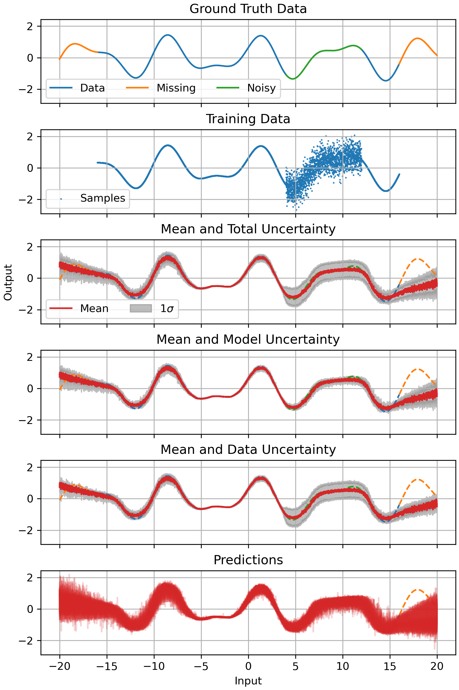

# Uncertainty Networks

Implementation of [MC Dropout](https://arxiv.org/abs/1506.02142) and [Deep Ensembles](https://arxiv.org/abs/1612.01474) for model uncertainty estimation in deep neural networks.

Features:
- Estimation of model (epistemic) uncertainty for MLPs and GRUs
- Supports propagation of uncertainty across different modules
- Example script to train network that estimate both model & data uncertainties



## Installation

To install, run:
```
pip install .
```

## Usage
Examples for usage can be found in the `scripts` folder.
